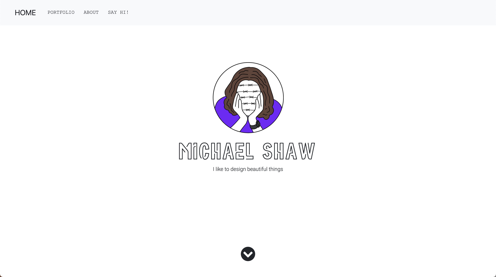

# Michael Shaw - Portfolio

## Project Description

This is a portfolio for Michael Shaw. Contact details are available below. Please reach out if you would like to work together. 

## Table of Contents
* [Installation](#installation)  
* [Technologies](#technologies)
* [License](#license)
* [Questions](#questions)

## Installation 

To install this application, a text editor such as Visual Studio Code is required. This can be downloaded here. Simply clone from the GitHub repository from there.

You can view this portfolio live on GitHub pages [here](https://michaelshxw.github.io/professional-materials/).

## Technologies 

* HTML
* CSS
* Bootstrap 

## License

This project is licensed with the MIT license.

## Questions

This portfolio was designed and created by [Michael Shaw](http://www.github.com/michaelshxw). For any questions or queries, please email me here: [michaelshxw@gmail.com](mailto:michaelshxw@gmail.com)

